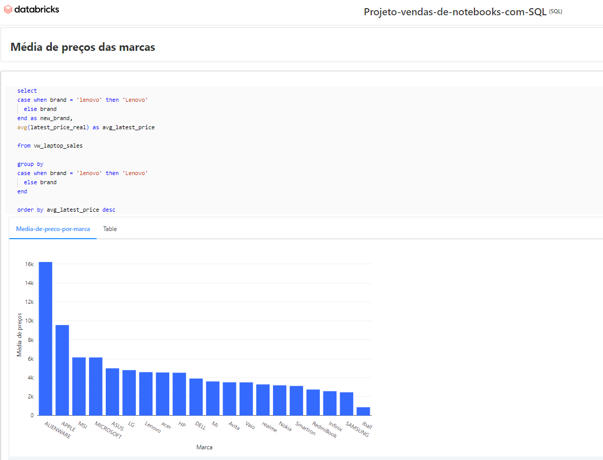

# Projetos de Análise de Dados com SQL, Excel e Google Sheets

Projetos realizados durante meus estudos para desenvolvimento de habilidades.

| :placard: Vitrine.Dev | [cursos.alura.com.br/vitrinedev/paulo-emilio](https://cursos.alura.com.br/vitrinedev/paulo-emilio) |
| -------------  | --- |
| :sparkles: Nome        | **Análises de Dados com SQL, Excel e Google Sheets**
| :label: Tecnologias | excel, google sheets, sql
| :rocket: URL        | [Análise de dados com Excel](https://1drv.ms/x/s!AiFjwGBG_LP41UI6SX_aRP8mGLXX?e=iC76bP) [Análise de dados com Google Sheets](https://docs.google.com/spreadsheets/d/1_6NjF84UREH427WEjHjJx-LYnk-lknzfwNVP-voViqw/edit?usp=sharing) [Análise descritiva com SQL](https://thunder-root-duchess.glitch.me/)

<!-- Inserir imagem com a #vitrinedev ao final do link -->

## Detalhes do projeto

Estes projetos foram desenvolvidos durante as minhas formações "Excel" e "Data Analysis com Google Sheets" na Alura; e projeto independente em SQL usando o Databricks. Utilizei dados para análises, criação de dashboards, tabelas e mais.
