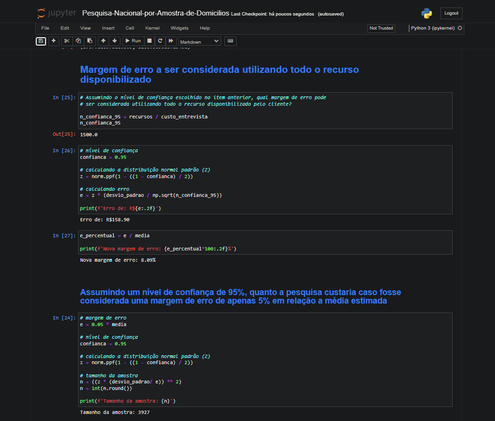

# Pesquisa Nacional por Amostra de Domicílios - 2015

## Este projeto utiliza o conjunto de dados da PNAD 2015 para explorar informações relevantes e responder a questões específicas, destacando a análise de renda, a probabilidade de selecionar grupos com determinada composição e a estimativa do tamanho da amostra necessário para atingir diferentes níveis de confiança. 
## Tecnologias: Python, Pandas, Numpy, Scipy.

