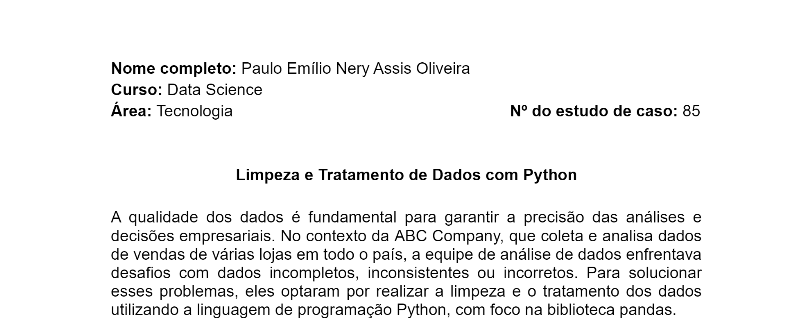

# Projetos em Data Science

Projetos acadêmicos desenvolvidos durante minha busca por aprendizado na área de Ciência de Dados.

| :placard: Vitrine.Dev | [cursos.alura.com.br/vitrinedev/paulo-emilio](https://cursos.alura.com.br/vitrinedev/paulo-emilio) |
| -------------  | --- |
| :sparkles: Nome        | **Projetos em Data Science**
| :label: Tecnologias | python, anaconda, jupyter
| :rocket: URL        | [Análise Descritiva IBGE](Analise-Descritiva-IBGE/Projeto/Análise-Descritiva-IBGE.ipynb) [Pesquisa Nacional por Amostra de Domicílios](Probabilidades-e-Estimacoes/Projeto/Pesquisa-Nacional-por-Amostra-de-Domicilios.ipynb) [Regressão Linear - HousePricing](Regressao-Linear/Projeto) [Estudo de Caso - Pós graduação Data Science](Projeto-Pos-Graduacao-Data-Science/Limpeza%20e%20Tratamento%20de%20Dados%20com%20Python%20-%20Paulo%20Emilio%20Oliveira.pdf)

<!-- Inserir imagem com a #vitrinedev ao final do link -->

## Detalhes do projeto

Projetos desenvolvidos utilizando o Anaconda e Jupyter Notebook para: análise de dados, estatística, modelagem, visualização e machine learnig com python, utilizando bibliotecas como: Seaborn, Matplotlib, SciPy, Pandas, scikit-learn, entre outros. 
